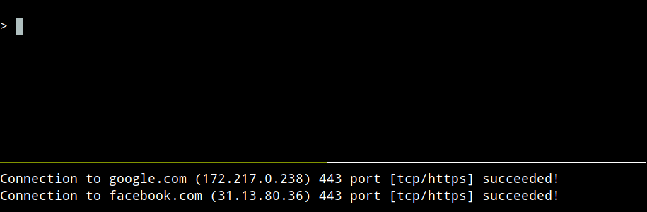

<h1 align="center">sirubo</h1>

<p align="center">
	<em>Blocks outbound tech conglomerate (AS) network traffic.</em>
	<br>
	<br>
	
</p>

<br>



<br>

# Table of Contents


- [Usage](#usage)
- [Description](#description)
- [Requirements](#requirements)
- [Motive](#motive)
- [Install](#install)
- [Uninstall](#uninstall)
- [Files](#files)
    - [Programs](#programs)
    - [Configurations](#configurations)
    - [Services](#services)
- [License](#license)

<br>

# Usage
```
sirubo [c|create] [h|halt|stop] [r|resume] [s|show]
```

<br>

  Command           | Description
  ---               | ---
  `c` `create`      | Create and start ruleset enforcement and persistence.
  `h` `halt` `stop` | Stop ruleset enforcement and persistence.
  `r` `resume`      | Resume ruleset enforcement and persistence.
  `s` `show`        | Show ruleset.

<br>

# Description

The sirubo utility is a POSIX shell script that makes use of:

  - Transport-layer packet filtering; in particular, nftables on Linux
    and pf on OpenBSD, to facilitate the rejection of outgoing traffic
    to autonomous system network, or ASN, prefixes (subnets).

  - whois, to perform a query for ASN prefixes (subnets).

<br>

# Requirements

  Linux    | OpenBSD
  -----    | -------
  nftables | pf
  whois    | whois
  systemd  |

<br>

# Motive

Preventing passive and nonconsensual telemetry, and the infringement of
one's privacy thereafter, from intrusively inquisitive big tech
conglomerates, such as Meta (Facebook) and Alphabet (Google).

<br>

# Install

1. Install sirubo:
```
sudo make install
```

2. To illustrate, add the following ASN to /usr/local/etc/sirubo.conf:
```
AS32934 # Google
```

3. Create a new firewall ruleset:
```
sirubo c
```

4. Test your newly created firewall ruleset:
```
nc -vw 1 google.com 443
```

  The command should print a message similar to this:

  ```
  nc: connect to google.com (0.0.0.0) port 443 (tcp) failed: Connection refused
  ```

  This will indicate that your operating system firewall is configured
  to reject all outbound traffic directed at Google's ASN prefixes.

<br>

# Uninstall

1. Within this repository, uninstall sirubo:
```
make uninstall
```

   Or, optionally, uninstall sirubo and delete its configuration files:

   ```
   make clean
   ```

<br>

# Files

  ### Programs

  - `/usr/local/bin/sirubo` - The utility itself.


  ### Configurations

  - `/usr/local/etc/sirubo.conf` - Contains ASNs that you, the user, specify for
    rejection.
  - `/usr/local/etc/sirubo.ruleset` - Contains a cached firewall ruleset.
  - `/usr/local/etc/sirubo.ruleset.backup` - Contains a defunct firewall ruleset
    that is reserved as a backup when creating a new ruleset manually or
    automatically.


  ### Services

  - `/etc/systemd/system/sirubo.service` **(Linux)** - A service that facilitates
    firewall ruleset persistency and automatic ruleset updates with every
    operating system reboot.

  - `/etc/rc.d/sirubo` **(OpenBSD)** - A service that facilitates firewall ruleset
    persistency and automatic ruleset updates with every operating system
    reboot.

<br>

# License

See the `LICENSE` file for details.
